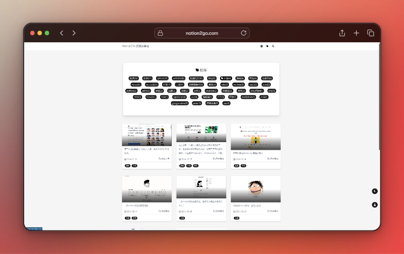

# 仿Notion页面导航站主题

欢迎使用仿Notion页面导航站主题！这个项目基于Notionnext构建，旨在为用户提供一个简洁、美观的导航页面，模仿Notion的设计风格。

## 特性

- **简洁的界面**：采用Notion的设计理念，提供清晰的导航体验。
- **响应式设计**：在各种设备上都能良好显示。
- **自定义功能**：支持用户根据需求自定义导航链接和样式。
## 网站预览

`https://notion2go.com`

## 截图预览

## 安装

替换matery到你的Notionnext项目theme主题文件夹下（如果重名可以换个名字）

## 使用
- blog.config.js 中修改theme为matery
- 打开浏览器，访问 `http://localhost:3000` 查看你的导航站。
- 根据需要修改 `config.js` 文件，添加或删除导航链接。

## 贡献

欢迎任何形式的贡献！如果你有建议或发现了问题，请提交 issue 或者直接发起 pull request。

## 许可证

本项目采用 MIT 许可证，详情请查看 [LICENSE](LICENSE) 文件。

